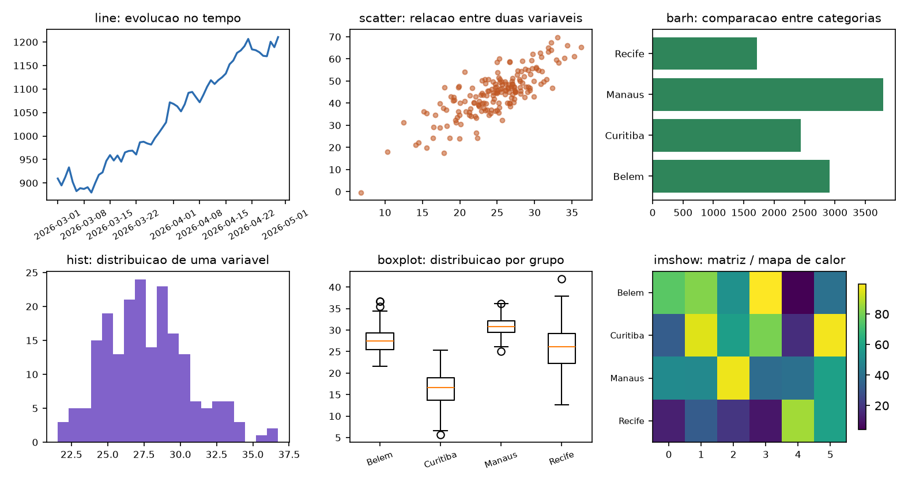
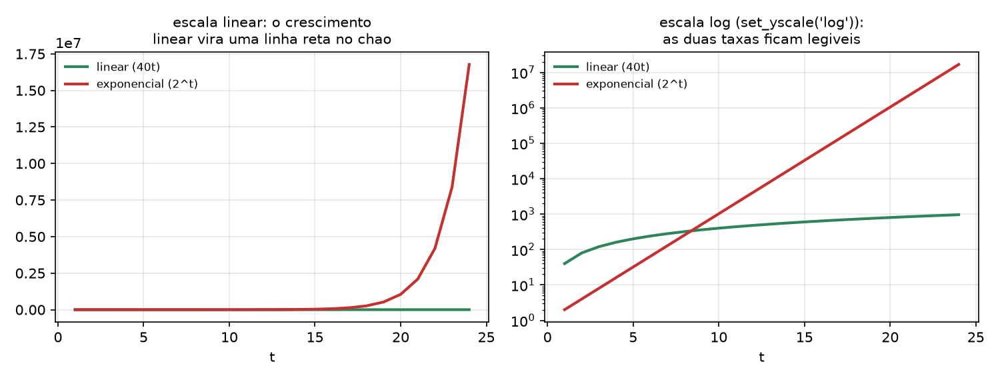

# Visualização de dados com Matplotlib {#sec-cap083}

O `groupby` do @sec-cap082 devolveu uma tabela com sessenta linhas de faturamento diário. Olhando os números, ninguém responde "está subindo?", "aquela queda foi feriado ou defeito?", "Manaus destoa das outras?". Um gráfico responde as três em dois segundos.

Matplotlib é a biblioteca de gráficos do Python desde 2003. Ela é a base sobre a qual `pandas.plot`, `seaborn` e boa parte do ecossistema científico foram construídos — o que significa que, mesmo usando uma camada mais alta, é a Matplotlib que você vai ajustar quando o resultado não sair como queria.

Este capítulo usa **Matplotlib 3.11.1** com **pandas 3.0.5**.

```bash
pip install matplotlib
```

## A escolha que determina tudo: `pyplot` ou objetos

Matplotlib tem duas interfaces, e a confusão entre elas é a causa da maioria dos problemas de quem está começando.

::: {#fig-mpl-apis}
```{.tikz}
%%| filename: mpl-apis
%%| alt: Comparacao entre a interface pyplot com estado global e a interface orientada a objetos
\begin{tikzpicture}[
  pn/.style={draw,rounded corners,align=left,text width=6.0cm,
             minimum height=5.4cm,font=\scriptsize},
  tt/.style={font=\small\bfseries,align=center}
]
  \path (-0.8,-4.4) rectangle (14.2,3.6);

  \node[tt] at (3.2,3.1) {\texttt{pyplot} --- estado global};
  \node[tt] at (10.4,3.1) {orientada a objetos --- explicita};

  \node[pn,fill=manualred!14] at (3.2,0.1)
    {\texttt{plt.plot(x, y)}\\
     \texttt{plt.title("vendas")}\\
     \texttt{plt.xlabel("dia")}\\
     \texttt{plt.savefig("g.png")}\\[6pt]
     Cada chamada age sobre a\\
     \textbf{figura atual}, guardada num\\
     estado global do modulo.\\[6pt]
     \textbf{quebra quando:}\\
     -- ha mais de um grafico\\
     -- o codigo vira funcao\\
     -- roda dentro de um laco\\
     -- alguem chamou \texttt{plt} antes\\[6pt]
     \textit{herdado do MATLAB; util\\
     so para um grafico rapido\\
     no REPL}};

  \node[pn,fill=manualgreen!16] at (10.4,0.1)
    {\texttt{fig, ax = plt.subplots()}\\
     \texttt{ax.plot(x, y)}\\
     \texttt{ax.set\_title("vendas")}\\
     \texttt{ax.set\_xlabel("dia")}\\
     \texttt{fig.savefig("g.png")}\\[6pt]
     Voce segura os objetos.\\
     Nao ha estado escondido.\\[6pt]
     \textbf{funciona sempre:}\\
     -- varios \texttt{Axes} numa \texttt{Figure}\\
     -- funcao que recebe \texttt{ax}\\
     -- teste automatizado\\
     -- composicao com \texttt{seaborn}\\[6pt]
     \textit{a recomendacao oficial da\\
     documentacao desde 2021}};

  \node[draw,rounded corners,fill=manualblue!14,align=center,text width=13.0cm,
        font=\scriptsize] at (6.8,-3.6)
    {O nome do metodo denuncia a interface: \texttt{plt.xlabel(...)} contra \texttt{ax.set\_xlabel(...)}.
     Numa funcao que desenha, receba \texttt{ax} como parametro --- e quem chama decide onde o grafico vai parar.};
\end{tikzpicture}
```
As duas interfaces da Matplotlib. Só uma delas escala.
:::

A regra é curta: **use `plt.subplots()` para obter os objetos e trabalhe com eles.**

```python
import matplotlib.pyplot as plt

fig, ax = plt.subplots(figsize=(6, 3))
print("type(fig)      :", type(fig).__name__)
print("type(ax)       :", type(ax).__name__)
linhas = ax.plot([1, 2, 3], [2, 4, 3])
print("ax.plot devolve:", type(linhas).__name__, "de", type(linhas[0]).__name__)
```

```text
type(fig)      : Figure
type(ax)       : Axes
ax.plot devolve: list de Line2D
```

`plt.subplots()` faz duas coisas: cria uma `Figure` e cria os `Axes` dentro dela. E `ax.plot` devolve uma **lista** de `Line2D` porque um `plot` pode desenhar várias linhas de uma vez — daí o `linha, = ax.plot(...)` com vírgula que você vê por aí.

## Anatomia

{#fig-mpl-anatomia}

Três palavras explicam a API inteira:

- **`Figure`** — a tela, o que vira arquivo. Tem tamanho (`figsize`, em polegadas) e resolução (`dpi`).
- **`Axes`** — uma área de plotagem com seus eixos, escalas, título e legenda. Uma `Figure` pode ter vários. **Cuidado com o nome**: `Axes` (plural em inglês) é o gráfico inteiro; `axis` (singular) é *um* eixo, o `x` ou o `y`.
- **`Artist`** — todo o resto. Cada linha, marcador, texto, borda e tique é um objeto que você pode pegar e modificar.

Os métodos seguem o padrão `ax.set_<coisa>()`: `set_title`, `set_xlabel`, `set_ylabel`, `set_xlim`, `set_yscale`. Quando não lembrar o nome, `ax.set(title="...", xlabel="...")` aceita vários de uma vez.

### Vários gráficos

```python
fig, axs = plt.subplots(2, 3, figsize=(10.5, 5.6))
```

```text
subplots()      -> ax e um Axes
subplots(1,3)   -> ndarray de forma (3,)
subplots(2,3)   -> ndarray de forma (2, 3)
```

Com mais de um, `subplots` devolve um **array NumPy** de `Axes` — indexado como qualquer array (@sec-cap080), inclusive com `axs.flat` para percorrer todos num laço. Com um só, devolve o objeto direto. Essa diferença de tipo quebra código genérico; `squeeze=False` força sempre a forma 2D.

`fig.tight_layout()` no final ajusta os espaçamentos para que rótulos não se sobreponham. É praticamente obrigatório em figura com vários painéis.

## Os tipos e quando usar cada um

{#fig-mpl-tipos}

A escolha do tipo é a decisão de visualização mais importante, e ela decorre da pergunta:

| pergunta | gráfico | método |
|---|---|---|
| como evoluiu no tempo? | linha | `ax.plot` |
| duas variáveis se relacionam? | dispersão | `ax.scatter` |
| como as categorias se comparam? | barras | `ax.bar`, `ax.barh` |
| como os valores se distribuem? | histograma | `ax.hist` |
| como a distribuição varia por grupo? | caixa, violino | `ax.boxplot`, `ax.violinplot` |
| como se comporta uma matriz? | mapa de calor | `ax.imshow`, `ax.pcolormesh` |

Três observações que economizam retrabalho:

- **`barh` em vez de `bar` quando os rótulos são longos.** Nome de cidade na horizontal se lê; na vertical, vira texto inclinado a 45 graus.
- **Barra sempre começa no zero.** Comprimento é a codificação visual, e truncar o eixo mente sobre a proporção. Linha e dispersão não têm essa obrigação.
- **Histograma depende do `bins`.** O padrão de 10 esconde estrutura; teste `bins=30`, `bins="auto"` e olhe os dois. Um histograma com poucos intervalos é um resumo, não um diagnóstico.

## Do padrão ao publicável

{#fig-mpl-antes-depois}

O painel da esquerda tem um defeito que a Matplotlib não avisa: **duas chamadas a `ax.bar` com as mesmas posições desenham uma barra em cima da outra**, e a série de 2025 desapareceu inteira sob a de 2026. O gráfico está errado e parece certo.

A correção é deslocar as posições à mão:

```python
larg = 0.38
pos = np.arange(len(dados))
ax.bar(pos - larg / 2, dados["2025"], larg, label="2025", color="#a0aec0")
ax.bar(pos + larg / 2, dados["2026"], larg, label="2026", color="#2b6cb0")
ax.set_xticks(pos, dados["cidade"])
ax.set_ylabel("faturamento (R$ mil)")
ax.legend(frameon=False)
ax.spines[["top", "right"]].set_visible(False)
ax.grid(axis="y", alpha=0.3)
ax.set_axisbelow(True)
```

As últimas quatro linhas são o acabamento que separa um gráfico de rascunho de um apresentável, e valem para praticamente qualquer figura:

- **`set_ylabel` com unidade.** Um eixo sem unidade obriga quem lê a adivinhar.
- **`legend(frameon=False)`** — a moldura da legenda quase nunca acrescenta.
- **`spines[["top","right"]].set_visible(False)`** — remove as duas bordas que não codificam nada.
- **`grid(axis="y", alpha=0.3)` com `set_axisbelow(True)`** — grade discreta, e atrás dos dados, não por cima.

E, para rotular valores diretamente nas barras, `ax.bar_label(barras, fmt="%.0f")` faz o que o `annotate` da figura fez, com uma linha.

## Escalas

{#fig-mpl-escala}

Quando as grandezas diferem por ordens de magnitude, a escala linear esconde tudo: no painel da esquerda a curva linear parece constante em zero, porque o eixo precisa acomodar dezessete milhões. `ax.set_yscale("log")` resolve, e ainda tem uma propriedade útil — **em escala log, crescimento exponencial vira reta**, e a inclinação é a taxa.

Outras conversões do mesmo tipo: `set_xscale("log")` para distribuições de cauda longa e `symlog` quando os dados incluem zero e negativos, que o log puro não representa.

## Salvar

```python
fig.savefig("grafico.png", dpi=150, bbox_inches="tight")
```

```text
png dpi=150       27,684 bytes
png dpi=300       63,151 bytes
svg dpi=-         16,001 bytes
pdf dpi=-          8,083 bytes
```

O formato decorre do destino:

- **PNG** para tela, e-mail e apresentação. `dpi=150` para tela, `dpi=300` para impressão.
- **SVG ou PDF** para publicação — são vetoriais, ampliam sem borrar, e no caso deste gráfico ainda ficaram **menores** que o PNG.
- **`bbox_inches="tight"`** corta a margem branca em excesso; sem ele, um rótulo longo pode sair cortado do arquivo mesmo aparecendo na tela.

Duas notas de ambiente. Em script sem interface gráfica (servidor, CI), defina o *backend* não interativo **antes** de importar o `pyplot`:

```python
import matplotlib
matplotlib.use("Agg")
import matplotlib.pyplot as plt
```

E **feche as figuras**:

```text
figuras abertas depois de 5 subplots sem close: 5
depois de plt.close('all')                    : 0
```

Cada `plt.subplots()` registra a figura no gerenciador do `pyplot`, e ela **não** é coletada pelo GC enquanto estiver lá. Um laço que gera mil gráficos sem `plt.close(fig)` consome memória até o processo morrer — e a Matplotlib avisa só depois de vinte figuras abertas.

## O atalho: `DataFrame.plot`

```python
eixo = df.plot(figsize=(6, 3))
```

```text
d.plot() devolve: Axes
mesmo objeto do ax de plt.subplots: True
```

O pandas embute uma camada sobre a Matplotlib que entende índice, colunas e nomes: `df.plot()` desenha todas as colunas numéricas contra o índice, com legenda pronta. Aceita `kind="bar"`, `"barh"`, `"hist"`, `"box"`, `"scatter"`, `"area"`, e ainda `df.plot(subplots=True)`.

O ponto que torna isso útil de verdade: **`plot` devolve o `Axes`**, e aceita `ax=` como argumento. Ou seja, você usa o atalho para o traçado e a API de objetos para o acabamento:

```python
fig, ax = plt.subplots(figsize=(7, 3.5))
df.plot(ax=ax, lw=1.6)
ax.set_ylabel("faturamento (R$)")
ax.spines[["top", "right"]].set_visible(False)
fig.savefig("vendas.png", dpi=150, bbox_inches="tight")
```

Para gráficos estatísticos (distribuição por grupo, matriz de correlação, facetas), `seaborn` é a camada seguinte — e ela também trabalha sobre `Axes` da Matplotlib, então tudo deste capítulo continua valendo.

## Estilo e configuração

```text
total de estilos: 28
alguns: Solarize_Light2, bmh, classic, dark_background, fast, fivethirtyeight
figure.figsize : [6.4, 4.8]
figure.dpi     : 100.0
font.size      : 10.0
```

`plt.style.use("seaborn-v0_8-whitegrid")` troca a aparência inteira numa linha. Para ajustes finos, `plt.rcParams` é o dicionário de configuração global:

```python
plt.rcParams.update({"figure.dpi": 120, "font.size": 11, "axes.grid": True})
```

Melhor ainda é `with plt.rc_context({...}):`, que restringe a mudança ao bloco (@sec-cap040) em vez de deixar estado global alterado para o resto do processo.

O ciclo de cores padrão tem dez cores escolhidas para serem distinguíveis. Duas cautelas: **cerca de 8% dos homens têm alguma deficiência na percepção de cores**, e vermelho contra verde é justamente o par que some — use `viridis`, `cividis` ou marcadores diferentes. E **nunca use o mapa `jet`**: ele cria fronteiras que não existem nos dados e some quando impresso em cinza.

## O gráfico honesto

Um gráfico é um argumento, e ele pode mentir sem que uma única linha de código esteja errada:

- **Eixo y truncado num gráfico de barras** transforma 3% de diferença em "o dobro". Barra começa no zero, sempre.
- **Escala dupla no eixo y** (dois `twinx`) permite fazer duas séries quaisquer parecerem correlacionadas, escolhendo os limites convenientemente.
- **Ordenação por conveniência.** Categorias em ordem alfabética quando ordená-las por valor mudaria a conclusão.
- **Excesso de tinta.** Sombra, 3D, gradiente e fundo escuro não acrescentam informação e atrapalham a leitura de valores.
- **Média sem dispersão.** Quatro grupos com a mesma média podem ter distribuições completamente diferentes — é o que o *boxplot* mostra e o gráfico de barras esconde.

## 🐍 Jeito Pythônico

**`fig, ax = plt.subplots()` sempre.** A interface `pyplot` com estado global funciona no REPL e falha em tudo o mais: função, laço, notebook reexecutado fora de ordem, teste. Se você escreveu `plt.title(...)`, troque por `ax.set_title(...)`.

**Função que desenha recebe `ax` como parâmetro.** `def grafico_vendas(df, ax):` é composta, testada e reaproveitada; `def grafico_vendas(df):` que cria e salva a própria figura não é nenhuma das três.

**`plt.close(fig)` em qualquer laço que gera figuras.** O `pyplot` segura a referência, o coletor de lixo não pode fazer nada, e o vazamento só aparece na centésima iteração.

**`matplotlib.use("Agg")` antes do `import pyplot`** em script, servidor ou CI. Depois do import não tem efeito, e o erro que aparece fala de display, não de ordem de import.

**`bbox_inches="tight"` ao salvar**, e formato vetorial (SVG/PDF) quando o destino é publicação. É gratuito e evita o rótulo cortado que só se descobre no arquivo final.

**Rótulo com unidade em todo eixo, e legenda só quando há mais de uma série.** Legenda com um item é ruído; eixo sem unidade é adivinhação.

**`rc_context` em vez de mexer no `rcParams` global.** Mudança global de configuração é estado escondido — o mesmo problema que a API de objetos resolve, um nível acima.

**Barra começa no zero.** Não é preciosismo: é a diferença entre um gráfico e um argumento capcioso.

## 🧪 Laboratório

**Passo 1 — ambiente.**

```bash
mkdir lab-plot && cd lab-plot
python3.13 -m venv .venv
source .venv/bin/activate        # Windows: .venv\Scripts\activate
python -m pip install matplotlib pandas
python -c "import matplotlib; print(matplotlib.__version__, matplotlib.get_backend())"
```

**Passo 2 — os objetos.** Crie `fig, ax = plt.subplots()` e imprima os tipos, `fig.axes`, e confirme que `ax.get_figure() is fig`:

```text
type(fig)      : Figure
type(ax)       : Axes
ax.plot devolve: list de Line2D
```

Depois faça `subplots(1, 3)` e `subplots(2, 3)` e imprima `axs.shape` em cada caso.

**Passo 3 — a série temporal.** Com uma `Series` de 60 dias (use `cumsum` de ruído para ter tendência), desenhe a linha e acrescente, um de cada vez: título, rótulo dos dois eixos, grade com `alpha=0.3`, rotação dos tiques do x. Salve depois de cada acréscimo e compare os arquivos.

**Passo 4 — a grade de tipos.** Monte um `subplots(2, 3)` com linha, dispersão, barras horizontais, histograma, *boxplot* e `imshow`, cada um com título. Use `fig.tight_layout()` e observe o que muda se você tirá-lo.

**Passo 5 — o bug das barras.** Chame `ax.bar` duas vezes com as mesmas posições e séries diferentes. Confirme que **uma sumiu**. Depois corrija com o deslocamento de `±larg/2` e o `set_xticks`. Este é o único passo do laboratório em que o código errado não gera nenhum aviso.

**Passo 6 — acabamento.** Sobre o gráfico corrigido, aplique `legend(frameon=False)`, remoção das *spines* de cima e da direita, `grid(axis="y")` com `set_axisbelow(True)` e `bar_label`. Salve as duas versões lado a lado e compare.

**Passo 7 — escala.** Plote `40*t` e `2**t` para `t` de 1 a 24 no mesmo `Axes`, com escala linear e depois com `set_yscale("log")`. Na versão log, confirme que a exponencial virou uma reta e meça a inclinação.

**Passo 8 — formatos.** Salve o mesmo gráfico como PNG a 150 e 300 dpi, SVG e PDF, e compare os tamanhos:

```text
png dpi=150       27,684 bytes
png dpi=300       63,151 bytes
svg dpi=-         16,001 bytes
pdf dpi=-          8,083 bytes
```

Depois amplie o PNG e o SVG a 400% e olhe as bordas. Refaça um dos salvamentos **sem** `bbox_inches="tight"` com um rótulo de eixo bem longo.

**Passo 9 — o vazamento.** Escreva um laço que cria 30 figuras sem fechar e imprima `len(plt.get_fignums())` a cada dez. Observe o aviso da Matplotlib a partir da vigésima. Refaça com `plt.close(fig)` no fim de cada volta e confirme que o número fica em zero.

**Passo 10 — função composta.** Escreva `def barras_por_cidade(df, ax, ano):` que desenha num `Axes` recebido e **não** cria figura nem salva nada. Use-a para preencher um `subplots(1, 2)` com dois anos diferentes, e depois de novo para gerar uma figura de painel único. A mesma função serviu aos dois casos — é isso que a interface de objetos compra.

## Resumo

- Matplotlib tem duas interfaces. Use a **orientada a objetos**: `fig, ax = plt.subplots()` e depois `ax.set_*`. A `pyplot` com estado global só serve para um gráfico rápido no REPL.
- **`Figure`** é a tela, **`Axes`** é a área de plotagem (pode haver várias por figura) e **`Artist`** é cada elemento desenhado. Com mais de um painel, `subplots` devolve um array NumPy de `Axes`.
- A escolha do tipo decorre da pergunta: linha para tempo, dispersão para relação, barras para comparação, histograma para distribuição, caixa para distribuição por grupo, `imshow` para matriz.
- **Duas chamadas a `ax.bar` nas mesmas posições sobrepõem as barras sem nenhum aviso.** Barras agrupadas exigem deslocar as posições à mão.
- O acabamento que sempre vale: rótulo com unidade, `legend(frameon=False)`, remover as *spines* de cima e da direita, grade discreta com `set_axisbelow(True)`.
- `set_yscale("log")` quando as grandezas diferem por ordens de magnitude — e em log, exponencial vira reta.
- Ao salvar: PNG para tela (`dpi=150`) ou impressão (`dpi=300`), **SVG/PDF para publicação**, sempre com `bbox_inches="tight"`. Em servidor, `matplotlib.use("Agg")` **antes** do import do `pyplot`.
- **`plt.close(fig)` em laço**: o `pyplot` segura as figuras e elas não são coletadas sozinhas.
- `DataFrame.plot` é o atalho e **devolve o `Axes`**, aceitando `ax=` — combine o atalho com a API de objetos para o acabamento.
- Um gráfico é um argumento: barra começa no zero, ordene pelo que importa, escolha paletas seguras para daltonismo e nunca `jet`.
