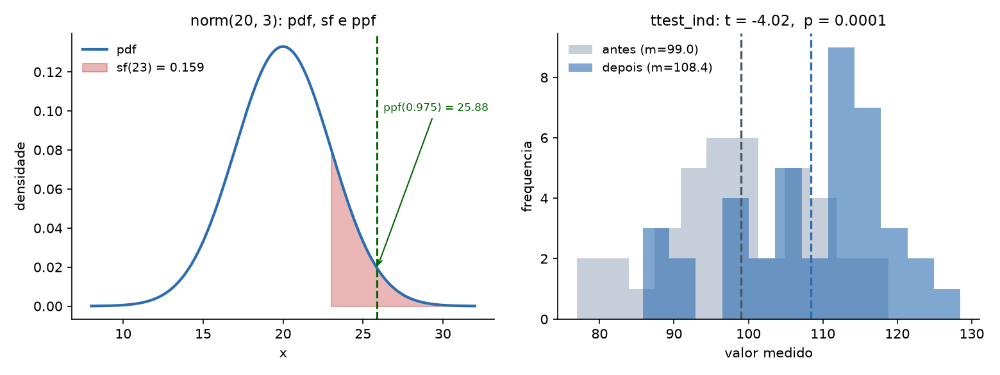
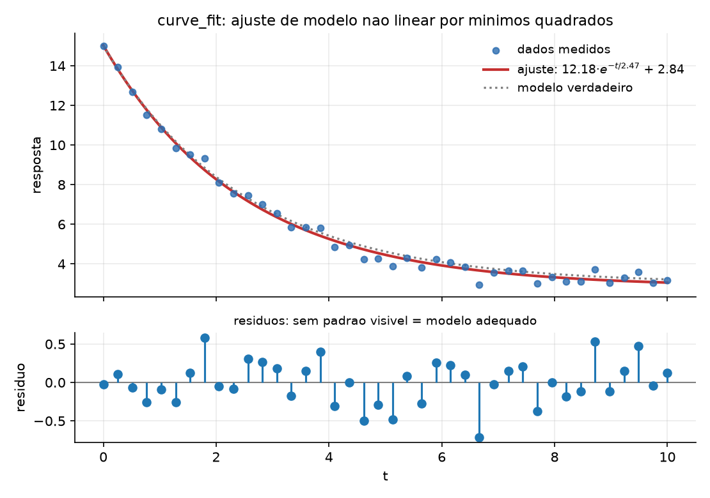
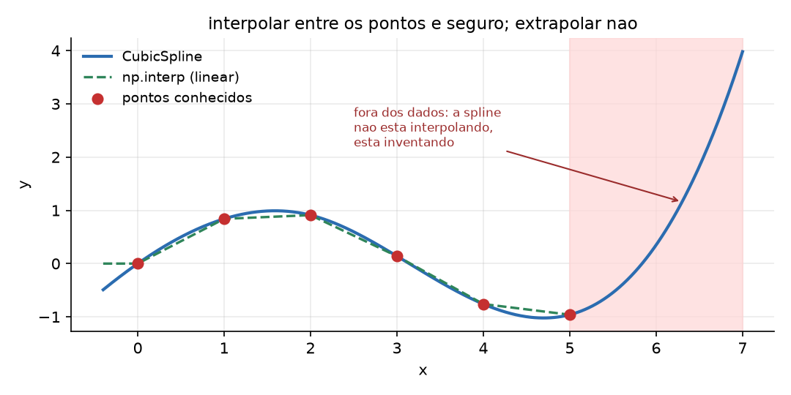
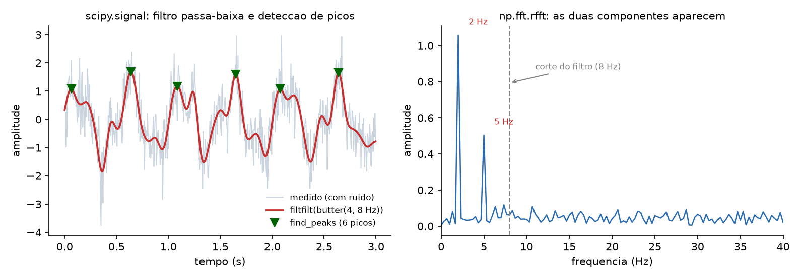

# SciPy e a computação científica aplicada {#sec-cap084}

O sensor registrou a resposta de um sistema decaindo ao longo de dez segundos. Você tem os pontos e sabe que a física é exponencial. Qual é a constante de tempo? Com que incerteza? E aquela diferença de nove pontos entre o grupo de controle e o tratado — é efeito ou é ruído?

NumPy dá o array e as operações elementares. **SciPy dá os algoritmos**: ajuste de curva, testes de hipótese, integração numérica, otimização, filtros, interpolação, álgebra linear avançada. É a camada onde o Python deixa de ser uma linguagem que manipula números e passa a ser uma ferramenta de análise numérica.

Este capítulo usa **SciPy 1.18.0** sobre NumPy 2.5.2.

```bash
pip install scipy
```

## O mapa

SciPy é grande, e a primeira dificuldade é saber onde procurar. Não existe `import scipy` que sirva de algo: **cada submódulo é importado separadamente**.

::: {#fig-scipy-mapa}
```{.tikz}
%%| filename: scipy-mapa
%%| alt: Mapa dos submodulos do SciPy e o que cada um resolve
\begin{tikzpicture}[
  bx/.style={draw,rounded corners,align=left,text width=3.9cm,
             minimum height=1.55cm,font=\scriptsize},
  tt/.style={font=\small\bfseries,align=center}
]
  \path (-0.4,-5.6) rectangle (13.8,3.3);

  \node[tt,text width=13.0cm] at (6.7,2.9)
    {\texttt{from scipy import stats, optimize, ...} --- cada submodulo se importa a parte};

  \node[bx,fill=manualblue!18] at (2.2,1.3)
    {\textbf{\texttt{stats}}\\
     distribuicoes, testes de\\
     hipotese, correlacao};
  \node[bx,fill=manualgreen!18] at (6.7,1.3)
    {\textbf{\texttt{optimize}}\\
     \texttt{curve\_fit}, \texttt{minimize},\\
     raizes de equacao};
  \node[bx,fill=manualyellow!22] at (11.2,1.3)
    {\textbf{\texttt{interpolate}}\\
     \texttt{CubicSpline}, grade\\
     irregular, suavizacao};

  \node[bx,fill=manualblue!18] at (2.2,-0.6)
    {\textbf{\texttt{integrate}}\\
     \texttt{quad} (integral definida),\\
     \texttt{solve\_ivp} (EDO)};
  \node[bx,fill=manualgreen!18] at (6.7,-0.6)
    {\textbf{\texttt{signal}}\\
     filtros, convolucao,\\
     \texttt{find\_peaks}, janelas};
  \node[bx,fill=manualyellow!22] at (11.2,-0.6)
    {\textbf{\texttt{spatial}}\\
     \texttt{KDTree}, distancias,\\
     Voronoi, casco convexo};

  \node[bx,fill=manualblue!18] at (2.2,-2.5)
    {\textbf{\texttt{linalg}}\\
     decomposicoes, \texttt{solve},\\
     autovalores};
  \node[bx,fill=manualgreen!18] at (6.7,-2.5)
    {\textbf{\texttt{sparse}}\\
     matriz esparsa: memoria\\
     proporcional aos nao-zeros};
  \node[bx,fill=manualyellow!22] at (11.2,-2.5)
    {\textbf{\texttt{fft}}, \texttt{ndimage},\\
     \textbf{\texttt{cluster}}, \textbf{\texttt{constants}}\\
     espectro, imagem, k-medias};

  \node[draw,rounded corners,fill=manualgray!16,align=left,text width=13.0cm,
        font=\scriptsize] at (6.7,-4.7)
    {\textbf{onde parar:} SciPy resolve o problema \textit{numerico}. Modelagem estatistica com formula
     e diagnostico e \texttt{statsmodels}; aprendizado de maquina e \texttt{scikit-learn};
     arrays em GPU sao \texttt{cupy} ou \texttt{jax}. Usar \texttt{scipy.optimize} para treinar um modelo
     de classificacao e possivel, e e a escolha errada.};
\end{tikzpicture}
```
Os submódulos mais usados do SciPy e a fronteira do que ele resolve.
:::

## `stats`: distribuições

Toda distribuição tem a mesma interface, e aprendê-la uma vez serve para as setenta:

```python
from scipy import stats

d = stats.norm(loc=20.0, scale=3.0)
print("pdf(20)      :", round(d.pdf(20), 6))
print("cdf(23)      :", round(d.cdf(23), 6))
print("sf(23)       :", round(d.sf(23), 6))
print("ppf(0.975)   :", round(d.ppf(0.975), 6))
print("intervalo 95%:", np.round(d.interval(0.95), 4))
print("rvs(5)       :", np.round(d.rvs(size=5, random_state=42), 4))
```

```text
pdf(20)      : 0.132981
cdf(23)      : 0.841345  <- P(X <= 23)
sf(23)       : 0.158655  <- P(X > 23), mais preciso que 1-cdf
ppf(0.975)   : 25.879892  <- o quantil
intervalo 95%: [14.1201 25.8799]
rvs(5)       : [21.4901 19.5852 21.9431 24.5691 19.2975]
```

{#fig-scipy-stats}

Os nomes valem decorar: **`pdf`** é a densidade, **`cdf`** acumula à esquerda, **`sf`** acumula à direita (a *survival function*), **`ppf`** é a inversa da `cdf` (dado o percentil, devolve o valor) e **`rvs`** sorteia.

Duas notas práticas. `sf(x)` é numericamente **mais preciso** que `1 - cdf(x)` na cauda, onde a subtração perde dígitos significativos (@sec-cap010) — para probabilidades da ordem de `1e-16`, `1 - cdf` devolve zero e `sf` devolve o valor certo. E `random_state=` aceita o gerador do @sec-cap080, o que mantém a reprodutibilidade sob controle.

A mesma interface serve para as demais:

```python
stats.binom(10, 0.3).pmf(3)     # 0.266828  -- discreta usa pmf, nao pdf
stats.poisson(4).cdf(2)         # 0.238103
stats.t(9).ppf(0.975)           # 2.262157  -- o valor crítico da tabela t
stats.chi2(3).sf(7.815)         # 0.049994
```

## `stats`: testes de hipótese

```python
t, p = stats.ttest_ind(antes, depois)
```

```text
media antes : 99.018
media depois: 108.389
t = -4.0200   p = 0.000133
rejeita H0 a 5%? True
```

Com 40 observações por grupo e diferença real de sete pontos, o teste detecta. Com 8 observações e diferença de três:

```text
t = -1.7388   p = 0.104006  -> rejeita? False
```

**O mesmo efeito, dados insuficientes, conclusão oposta.** Isso é poder estatístico, e é o motivo de "não deu significativo" nunca significar "não há efeito".

::: {.callout-important}
## O que o p-valor não é
O p-valor é a probabilidade de observar um efeito **ao menos tão extremo quanto este**, supondo que a hipótese nula seja verdadeira. Ele **não** é:

- a probabilidade de a hipótese nula ser verdadeira;
- a probabilidade de o resultado ser um acaso;
- uma medida do **tamanho** do efeito — com n grande, diferenças irrelevantes dão p minúsculo.

Relate sempre o tamanho do efeito e um intervalo de confiança ao lado do p. E não teste vinte hipóteses procurando uma abaixo de 0,05: a 5%, uma em vinte passa por sorte, e é isso que `statsmodels.stats.multitest` corrige.
:::

Os testes mais usados, e a pergunta de cada um:

| função | pergunta |
|---|---|
| `ttest_ind` | duas amostras independentes têm médias diferentes? |
| `ttest_rel` | o mesmo sujeito mudou entre antes e depois? |
| `mannwhitneyu` | idem `ttest_ind`, sem supor normalidade |
| `chi2_contingency` | duas variáveis categóricas são associadas? |
| `shapiro`, `normaltest` | esta amostra parece normal? |
| `pearsonr`, `spearmanr` | as duas variáveis são correlacionadas? |

Um detalhe que muda resultados: **`ttest_ind` supõe variâncias iguais por padrão.** Quando os grupos têm dispersões muito diferentes, `equal_var=False` (o teste de Welch) é o correto — e, na dúvida, Welch é a escolha mais segura, porque perde pouco quando as variâncias são iguais.

### Correlação: qual usar

```python
r_pearson  = stats.pearsonr(u, w).statistic
r_spearman = stats.spearmanr(u, w).statistic
```

```text
pearson (u,v)  r=0.9601  p=4.877e-56
pearson (u,w)  r=0.8144  <- relacao monotona nao linear
spearman(u,w)  r=1.0000  <- pega a monotonia
```

`w` é exatamente `exp(u)` — relação perfeita, mas curva. Pearson mede associação **linear** e viu 0,81; Spearman mede associação **monotônica** (trabalha com os postos) e viu 1,00. Quando a relação não é reta, ou quando há valores extremos, Spearman é mais informativo.

E, sempre: correlação de 0,96 com p de `1e-56` não diz nada sobre causa. Diz que, nestes dados, as duas variáveis andam juntas.

### Tabela de contingência

```python
chi2, p, gl, esperado = stats.chi2_contingency(tabela)
```

```text
observado:
[[45 15]
 [30 30]]
esperado :
[[37.5 22.5]
 [37.5 22.5]]
chi2=6.9689  gl=1  p=0.008294
```

A matriz `esperado` é a parte mais útil da saída: é o que se veria se não houvesse associação nenhuma. Comparar observado com esperado célula a célula diz **onde** está a diferença, o que o p-valor sozinho não diz.

## `optimize`: ajustar um modelo aos dados

Esta é, na prática, a função mais usada do SciPy inteiro:

```python
from scipy import optimize

def modelo(t, a, tau, c):
    return a * np.exp(-t / tau) + c

popt, pcov = optimize.curve_fit(modelo, t_obs, y_obs, p0=(10.0, 1.0, 1.0))
erros = np.sqrt(np.diag(pcov))
```

```text
parametro   verdadeiro   estimado   erro-padrao
a              12.0000    12.1788        0.1751
tau             2.5000     2.4739        0.0906
c               3.0000     2.8448        0.1105

residuo: media=0.00000  desvio=0.29078
R2 = 0.992633
```

{#fig-scipy-ajuste}

Três coisas para levar deste exemplo:

**A primeira letra do modelo é a variável independente; o resto são parâmetros a ajustar.** É essa convenção que permite escrever o modelo como uma função Python comum.

**`pcov` é a matriz de covariância, e `sqrt(diag(pcov))` são os erros-padrão.** Um ajuste sem incerteza não é um resultado — `tau = 2.47` significa pouco; `tau = 2.47 ± 0.09` significa algo. Se a matriz vier cheia de `inf`, o ajuste não convergiu de verdade, mesmo que `popt` tenha números plausíveis.

**Olhe os resíduos, não o R².** Um R² de 0,99 pode conviver com resíduos em forma de U — sinal de que o modelo está errado, ainda que ajuste bem. Resíduo bom é o que parece ruído: média zero e nenhum padrão visível.

### `p0` não é opcional

```python
optimize.curve_fit(logistica, xs, ys)              # sem chute inicial
optimize.curve_fit(logistica, xs, ys, p0=(90.0, 1.0, 10.0))
```

```text
sem p0  : [  40.007  -181.8341  126.0381]
com p0  : [99.8702  0.7193 11.9926]
```

Os valores verdadeiros eram `(100, 0.7, 12)`. Sem `p0`, o SciPy chuta `1.0` para tudo, o otimizador cai num mínimo local e devolve parâmetros absurdos — **com aviso apenas sobre a covariância, não sobre o resultado**. Ajuste não linear sem chute inicial informado é loteria; e a ordem de grandeza de cada parâmetro geralmente se lê no próprio gráfico dos dados.

### Minimizar e achar raiz

```python
r = optimize.minimize(custo, x0=[0.0, 0.0])
print("minimo em:", np.round(r.x, 8))
```

```text
sucesso : True
minimo em: [ 3.00000004 -1.00000007]
valor    : 2.0
```

`minimize` recebe uma função que devolve um escalar e procura o mínimo. Aceita `bounds=` para restringir a busca e `constraints=` para restrições mais gerais:

```text
com bounds [(0,1),(0,1)]: [1. 0.] valor 7.0
```

**Sempre confira `r.success` e `r.message`.** Um resultado de `minimize` que não convergiu vem com números do mesmo tipo dos de um que convergiu.

E, para raiz de uma equação de uma variável:

```python
optimize.root_scalar(lambda x: x**3 - 2*x - 5, bracket=[2, 3])
```

```text
raiz de x^3-2x-5 em [2,3]: 2.0945514815
f(raiz) = 3.55e-15 | convergiu: True
```

O `bracket=[a, b]` exige que a função troque de sinal no intervalo, e com isso a convergência é garantida — bem mais robusto que dar um chute e esperar o Newton achar.

## `interpolate`: entre os pontos, sim; fora, não

```python
from scipy import interpolate

spl = interpolate.CubicSpline(xk, yk)
print("np.interp(2.5)   :", np.interp(2.5, xk, yk))
print("CubicSpline(2.5) :", float(spl(2.5)))
print("derivada em 2.5  :", float(spl(2.5, 1)))
print("extrapolacao em 7:", float(spl(7.0)))
```

```text
np.interp(2.5)   : 0.525
CubicSpline(2.5) : 0.596875
derivada em 2.5  : -0.80875
extrapolacao em 7: 3.98  <- CUIDADO, invencao
```

{#fig-scipy-interp}

`np.interp` faz interpolação linear e resolve a maioria dos casos sem importar SciPy. `CubicSpline` dá uma curva suave, com derivadas contínuas — e por isso mesmo serve para estimar taxa de variação a partir de pontos discretos.

Mas note o último número. Os dados vão de 0 a 5; em `x = 7` a spline devolveu 3,98, quando a função de origem (um seno) nunca passa de 1. **Extrapolar com spline não é estimar, é inventar** — a cúbica que passa suavemente pelos últimos pontos continua subindo indefinidamente. Se precisar de valores fora do domínio, use um modelo com justificativa física e `curve_fit`, não interpolação.

## `integrate`: integrais e equações diferenciais

```python
from scipy import integrate

val, err = integrate.quad(lambda x: np.exp(-x**2), 0, np.inf)
```

```text
integral de exp(-x^2) de 0 a inf = 0.8862269255
valor exato sqrt(pi)/2           = 0.8862269255
erro estimado                    = 7.10e-09
```

Dez casas corretas, com limite infinito, numa linha. E `quad` devolve **o valor e a estimativa de erro** — o segundo elemento existe para ser conferido, não descartado.

Para equações diferenciais ordinárias, `solve_ivp`:

```python
def decaimento(t, y):
    return -0.5 * y

sol = integrate.solve_ivp(decaimento, [0, 10], [100.0], t_eval=[0, 2, 5, 10])
```

```text
t     : [ 0  2  5 10]
y(t)  : [100.        36.767016   8.216648   0.67539 ]
exato : [100.        36.787944   8.2085     0.673795]
```

A solução numérica bate com a analítica na terceira casa. Se precisar de mais precisão, `rtol` e `atol` controlam a tolerância; e `method="Radau"` ou `"BDF"` resolvem sistemas *stiff*, em que o passo adaptativo do método padrão fica lento demais.

## `signal`: filtrar e encontrar

{#fig-scipy-sinal}

```python
from scipy import signal

b, a = signal.butter(4, 8, btype="low", fs=fs)
filtrado = signal.filtfilt(b, a, ruidoso)
picos, props = signal.find_peaks(filtrado, height=0.8, distance=40)
```

```text
desvio do ruido residual (bruto)   : 0.6071
desvio do ruido residual (filtrado): 0.1691
picos encontrados : 6
nos instantes     : [0.065 0.64  1.085 1.65  2.075]
```

O filtro reduziu o ruído a 28% do original preservando o sinal. Dois pontos técnicos que importam:

**Use `filtfilt`, não `lfilter`.** Ambos aplicam o filtro; `lfilter` introduz atraso de fase (o sinal filtrado sai deslocado no tempo), e `filtfilt` aplica o filtro nos dois sentidos, cancelando o atraso. Para análise de dados já gravados, `filtfilt` é o certo; `lfilter` serve para processamento em tempo real, onde não se pode olhar o futuro.

**`find_peaks` sem parâmetros encontra ruído.** `height` descarta picos pequenos e `distance` impede que duas amostras vizinhas contem como dois picos. Sem os dois, um sinal ruidoso tem centenas de "picos".

E o espectro, com a FFT do próprio NumPy:

```python
espectro = np.fft.rfft(sinal)
freqs = np.fft.rfftfreq(sinal.size, 1 / fs)
```

```text
frequencias dominantes detectadas: [2. 5.] Hz
(o sinal foi construido com 2 Hz e 5 Hz)
```

`rfft` (em vez de `fft`) para sinal real: devolve só metade do espectro, que é toda a informação, e é duas vezes mais rápido. E `rfftfreq` produz o eixo de frequências — sem ele você tem amplitudes sem saber a que frequência correspondem.

## `spatial`, `linalg` e `sparse`

```python
from scipy import spatial

arvore = spatial.KDTree(pontos)      # 1000 pontos 2D
dist, idx = arvore.query([0.5, 0.5], k=3)
```

```text
3 vizinhos de (0.5, 0.5):
  indice  320  dist 0.012102  em [0.5097 0.5072]
  indice  697  dist 0.015511  em [0.4916 0.487 ]
  indice  699  dist 0.020996  em [0.497  0.4792]
pares a menos de 0.02: 649
```

Uma `KDTree` responde "quais são os k vizinhos mais próximos" em tempo logarítmico, em vez das n distâncias da força bruta. É a estrutura por trás de busca geográfica, de `KNeighbors` (@sec-cap085) e de qualquer coisa que precise de proximidade.

```python
from scipy import linalg

linalg.solve(A, b)      # resolve Ax = b
linalg.det(A)
linalg.eigvals(A)
```

Sobre a sobreposição com `numpy.linalg`: o `scipy.linalg` é mais completo (mais decomposições, mais rotinas LAPACK expostas) e é o que se deve usar quando a rotina existe nos dois. Mas não espere ganho automático de velocidade:

```text
np.linalg.inv    :  100.48 ms
scipy.linalg.inv :  147.26 ms
```

Nesta máquina o NumPy foi mais rápido. As duas chamam LAPACK; a diferença está nas verificações e na cópia de entrada, e varia com a compilação. **Meça antes de trocar por desempenho.**

E, quando a matriz é quase toda zeros:

```python
from scipy import sparse
M = sparse.random_array((5000, 5000), density=0.0005, format="csr")
```

```text
matriz 5000x5000
densa (float64) :     200,000,000 bytes
esparsa CSR     :         170,004 bytes
nao-zeros       :          12,500
```

Duzentos megabytes contra cento e setenta kilobytes — mil vezes menos, porque a esparsa guarda apenas os não-zeros e seus índices. Matriz de adjacência de grafo, matriz termo-documento de texto e sistema de elementos finitos são todos esparsos, e tratá-los como densos é a diferença entre rodar e estourar a memória.

## 🐍 Jeito Pythônico

**Importe o submódulo, não o pacote.** `from scipy import stats, optimize` — `import scipy` sozinho não dá acesso a nada, e essa é a primeira confusão de quem chega.

**`sf(x)` em vez de `1 - cdf(x)`** na cauda da distribuição. A subtração perde precisão exatamente onde você precisa dela.

**`p0` informado em todo `curve_fit` não trivial.** O chute padrão de 1,0 para tudo cai em mínimo local e devolve parâmetros absurdos com aviso só sobre a covariância.

**Sempre relate a incerteza.** `np.sqrt(np.diag(pcov))` para ajuste, `r.success` e `r.message` para otimização, o erro estimado do `quad`. Resultado numérico sem incerteza é opinião com casas decimais.

**Olhe os resíduos, não o R².** R² alto com resíduo estruturado significa modelo errado que ajusta bem.

**`filtfilt` para dados gravados, `lfilter` para tempo real.** A diferença é atraso de fase, e ele desloca todos os picos que você for medir depois.

**`equal_var=False` no `ttest_ind`** quando as dispersões diferem — e, na dúvida, também. Welch perde pouco no caso simétrico.

**Não extrapole com spline.** Fora do domínio dos dados, interpolação vira invenção. Extrapolação exige modelo com justificativa.

**Matriz quase vazia é `scipy.sparse`.** Mil vezes menos memória não é otimização prematura; é a diferença entre o programa rodar e não rodar.

**Saiba onde SciPy termina.** Regressão com diagnóstico é `statsmodels`; aprendizado de máquina é `scikit-learn`. Forçar `scipy.optimize` nesses papéis funciona e é a escolha errada.

## 🧪 Laboratório

**Passo 1 — ambiente.**

```bash
mkdir lab-scipy && cd lab-scipy
python3.13 -m venv .venv
source .venv/bin/activate        # Windows: .venv\Scripts\activate
python -m pip install scipy matplotlib
python -c "import scipy; print(scipy.__version__)"
```

**Passo 2 — a interface das distribuições.** Para `stats.norm(20, 3)`, calcule `pdf(20)`, `cdf(23)`, `sf(23)`, `ppf(0.975)` e `interval(0.95)`. Confirme que `cdf(23) + sf(23) == 1.0` e que `ppf(cdf(23))` volta a 23. Depois compare `sf(50)` com `1 - cdf(50)` e explique o resultado.

**Passo 3 — poder estatístico.** Gere dois grupos com diferença real de 3 unidades e desvio 12. Rode `ttest_ind` com n = 8, 20, 50, 200 e 1000, e monte uma tabela de p-valores. Descubra em que tamanho o teste passa a detectar. Depois repita 200 vezes com n = 20 e conte em quantas o p ficou abaixo de 0,05 — essa fração **é** o poder do teste.

**Passo 4 — o erro do p-valor.** Gere **dois grupos idênticos** (mesma distribuição) 100 vezes e conte quantas vezes o p ficou abaixo de 0,05. O resultado deve ficar perto de 5. Essa é a taxa de falso positivo, e é por isso que testar muitas hipóteses sem correção produz descobertas falsas.

**Passo 5 — correlação.** Com `u = rng.normal(0, 1, 100)` e `w = np.exp(u)`, compare `pearsonr` e `spearmanr`:

```text
pearson (u,w)  r=0.8144
spearman(u,w)  r=1.0000
```

Depois acrescente **um** ponto extremo em `u` e recalcule os dois. Qual dos dois se mexeu mais?

**Passo 6 — ajuste de curva.** Gere dados de `a*exp(-t/tau) + c` com ruído, ajuste com `curve_fit` e imprima os parâmetros com seus erros-padrão:

```text
a              12.0000    12.1788        0.1751
tau             2.5000     2.4739        0.0906
c               3.0000     2.8448        0.1105
```

Depois plote os resíduos. Em seguida ajuste um **modelo errado** (uma reta) aos mesmos dados, plote os resíduos e compare: o padrão em U é o diagnóstico.

**Passo 7 — o `p0`.** Ajuste uma logística sem `p0` e com `p0`:

```text
sem p0  : [  40.007  -181.8341  126.0381]
com p0  : [99.8702  0.7193 11.9926]
```

Depois inspecione `pcov` no caso sem `p0` e confirme que ela é inútil.

**Passo 8 — otimização.** Minimize `(x-3)² + (y+1)² + 2` e confirme o mínimo em `(3, -1)`. Depois acrescente `bounds=[(0,1),(0,1)]` e explique por que o resultado é `(1, 0)`. Por fim, minimize uma função com vários mínimos locais (por exemplo `x**4 - 3*x**3 + 2` mais um seno) partindo de dois `x0` diferentes e observe que chega a respostas diferentes.

**Passo 9 — interpolação e o limite dela.** Com seis pontos de `sin(x)` entre 0 e 5, compare `np.interp` e `CubicSpline` em `x = 2.5`. Depois avalie a spline em `x = 7` e compare com `sin(7)`:

```text
extrapolacao em 7: 3.98
```

`sin(7)` é 0,657. Plote o intervalo de 0 a 7 e olhe onde a curva se solta.

**Passo 10 — sinal.** Construa um sinal de 2 Hz + 5 Hz a 200 Hz de amostragem, acrescente ruído gaussiano, e: (a) filtre com `butter(4, 8, fs=fs)` mais `filtfilt`; (b) meça o desvio do resíduo antes e depois; (c) ache os picos com `find_peaks(height=0.8, distance=40)`; (d) calcule o espectro com `rfft`/`rfftfreq` e confirme os dois picos em 2 e 5 Hz. Refaça (a) com `lfilter` e compare a posição dos picos — o atraso de fase aparece na hora.

**Passo 11 — esparsa.** Crie uma matriz 5000×5000 com densidade 0,0005 em formato CSR e compare a memória com a versão densa:

```text
densa (float64) :     200,000,000 bytes
esparsa CSR     :         170,004 bytes
```

Depois multiplique a esparsa por um vetor e cronometre; faça o mesmo com a densa (se a memória permitir) e compare.

## Resumo

- SciPy é organizado em submódulos importados **separadamente** (`from scipy import stats, optimize, ...`); `import scipy` sozinho não dá acesso a nada.
- Todas as distribuições de `stats` compartilham a interface **`pdf`/`pmf`, `cdf`, `sf`, `ppf`, `rvs`**. `sf(x)` é mais preciso que `1 - cdf(x)` na cauda.
- **O p-valor não é a probabilidade de a hipótese nula ser verdadeira** nem uma medida do tamanho do efeito. Relate efeito e intervalo de confiança ao lado dele; "não significativo" com n pequeno não é evidência de ausência.
- `ttest_ind` supõe variâncias iguais: use **`equal_var=False`** (Welch) quando as dispersões diferirem. Pearson mede relação linear, **Spearman mede monotonia** e resiste a extremos.
- **`curve_fit` é a função mais usada do SciPy.** Passe `p0`, extraia os erros-padrão com `np.sqrt(np.diag(pcov))` e **julgue o ajuste pelos resíduos**, não pelo R².
- Verifique sempre o campo de convergência: `r.success` no `minimize`, o erro estimado do `quad`, e uma `pcov` finita no `curve_fit`.
- **Interpolar entre os pontos é seguro; extrapolar com spline é inventar** — a cúbica dispara fora do domínio sem nenhum aviso.
- Em `signal`, **`filtfilt` para dados gravados** (sem atraso de fase) e `lfilter` para tempo real; `find_peaks` precisa de `height` e `distance` para não contar ruído. Para espectro de sinal real, `rfft` com `rfftfreq`.
- `KDTree` responde vizinho-mais-próximo em tempo logarítmico; **`scipy.sparse` reduziu 200 MB a 170 KB** numa matriz com 0,05% de não-zeros.
- SciPy resolve o problema numérico. Modelagem estatística com diagnóstico é `statsmodels`; aprendizado de máquina é `scikit-learn`, o assunto do próximo capítulo.
