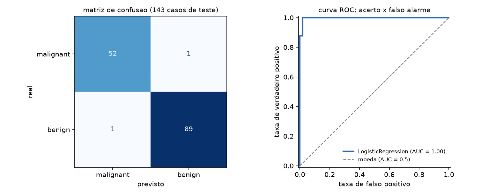
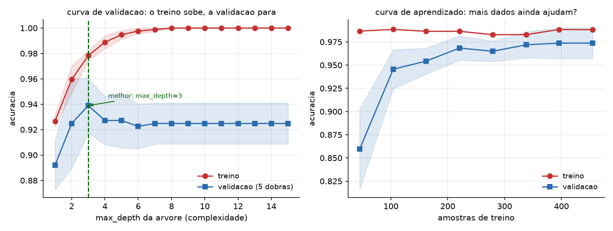
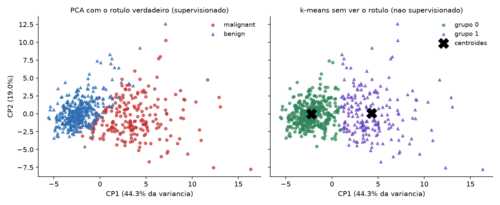

# Introdução ao aprendizado de máquina com scikit-learn {#sec-cap085}

Um modelo acertou 100% dos casos de treino. Em produção, acerta 60%. Outro, treinado com dados que não tinham sinal nenhum — ruído puro, rótulos sorteados —, apresentou 87% de acurácia em validação cruzada. Nos dois casos o código roda, não levanta exceção e produz números convincentes.

**O problema central do aprendizado de máquina não é ajustar, é generalizar.** Ajustar é fácil: com parâmetros suficientes, qualquer modelo decora qualquer conjunto de dados. Generalizar é acertar em dados que o modelo nunca viu — e quase toda a disciplina, incluindo a estrutura da biblioteca, existe para proteger essa medida.

Este capítulo usa **scikit-learn 1.9.0**. Ele é uma introdução: cobre o fluxo de trabalho, a API e os erros que invalidam resultados. Não cobre a matemática dos algoritmos, e não substitui um curso de estatística.

```bash
pip install scikit-learn
```

## O vocabulário

- **`X`** é a matriz de atributos (*features*): uma linha por amostra, uma coluna por variável. Forma `(n_amostras, n_atributos)`.
- **`y`** é o alvo (*target*): o que se quer prever. Vetor de tamanho `n_amostras`.
- **Supervisionado** é quando existe `y`. Se `y` é categoria, é **classificação**; se é número contínuo, é **regressão**.
- **Não supervisionado** é quando não existe `y` — agrupamento (`KMeans`) e redução de dimensionalidade (`PCA`).

```python
from sklearn.datasets import load_breast_cancer

dados = load_breast_cancer(as_frame=True)
X, y = dados.data, dados.target
print("X:", X.shape, "| y:", y.shape)
print("classes:", dict(zip(dados.target_names, np.bincount(y))))
```

```text
X: (569, 30) | y: (569,)
classes: {'malignant': 212, 'benign': 357}
proporcao da classe majoritaria: 0.6274
```

## A API única

O que faz do scikit-learn a biblioteca que é não são os algoritmos — é o fato de **todos** obedecerem à mesma interface:

- **`fit(X, y)`** aprende. É o único método que olha os dados de treino.
- **`predict(X)`** prevê. **`predict_proba(X)`** dá as probabilidades, quando o modelo as tem.
- **`transform(X)`** transforma (escaladores, codificadores, `PCA`).
- **`score(X, y)`** devolve a métrica padrão do estimador.

Trocar `LogisticRegression()` por `RandomForestClassifier()` é trocar uma linha. Essa uniformidade é o que permite comparar dez modelos num laço e é o motivo de `Pipeline` e `GridSearchCV` funcionarem com qualquer coisa.

## O fluxo, e onde ele vaza

::: {#fig-sklearn-fluxo}
```{.tikz}
%%| filename: sklearn-fluxo
%%| alt: O fluxo do aprendizado supervisionado e o ponto onde ocorre vazamento de dados
\begin{tikzpicture}[
  bx/.style={draw,rounded corners,align=center,text width=2.4cm,
             minimum height=1.2cm,font=\scriptsize},
  wd/.style={draw,rounded corners,align=left,text width=3.6cm,
             minimum height=1.7cm,font=\scriptsize}
]
  \path (-0.6,-5.2) rectangle (14.4,3.6);

  \node[bx,fill=manualgray!22] (dados) at (1.2,0) {\textbf{dados}\\\texttt{X}, \texttt{y}};
  \node[bx,fill=manualblue!20] (split) at (4.0,0)
    {\texttt{train\_test\_split}\\\texttt{stratify=y}};

  \node[wd,fill=manualgreen!18] (tr) at (8.5,1.9)
    {\textbf{treino --- 75\%}\\
     \texttt{pipe.fit(X\_tr, y\_tr)}\\
     o escalador aprende media\\
     e desvio \textbf{aqui}, e mais\\
     nada olha estes numeros};

  \node[wd,fill=manualyellow!28] (te) at (8.5,-1.9)
    {\textbf{teste --- 25\%}\\
     intocado ate o fim\\
     \texttt{pipe.predict(X\_te)}\\
     \textbf{transforma} com o que\\
     veio do treino, nao refaz};

  \node[bx,fill=manualblue!20] (met) at (13.0,0)
    {\textbf{metrica}\\a unica estimativa honesta};

  \draw[->,thick,manualgray] (dados) -- (split);
  \draw[->,thick,manualgray] (split) -- (tr);
  \draw[->,thick,manualgray] (split) -- (te);
  \draw[->,thick,manualgray] (tr) -- (met);
  \draw[->,thick,manualgray] (te) -- (met);

  \node[draw,rounded corners,fill=manualred!16,align=left,text width=13.2cm,
        font=\scriptsize] at (6.9,-4.1)
    {\textbf{vazamento de dados:} qualquer \texttt{fit} --- de escalador, de imputador, de seletor de
     atributos --- que veja o conjunto de teste contamina a metrica.
     \texttt{StandardScaler().fit(X)} antes do \textit{split} e o caso classico;
     selecao de atributos sobre \texttt{X} inteiro e o caso \textbf{grave}.
     A defesa nao e disciplina: e por o preprocessamento dentro de um \texttt{Pipeline}, que o
     \texttt{cross\_val\_score} refaz do zero em cada dobra.};
\end{tikzpicture}
```
O fluxo supervisionado. A caixa amarela só é aberta no fim, uma vez.
:::

```python
from sklearn.model_selection import train_test_split

X_tr, X_te, y_tr, y_te = train_test_split(
    X, y, test_size=0.25, random_state=42, stratify=y)
```

```text
treino: 426 | teste: 143
proporcao da classe 1 no treino: 0.6268
proporcao da classe 1 no teste : 0.6294
```

Três argumentos, três razões. **`test_size`** reserva a parte que mede; **`random_state`** torna o resultado reprodutível; **`stratify=y`** mantém a proporção das classes nas duas partes — sem ele, uma classe rara pode ficar quase toda de um lado, e a métrica passa a medir o sorteio.

### O piso

Antes de qualquer modelo, saiba o que é "melhor que nada":

```python
from sklearn.dummy import DummyClassifier
bobo = DummyClassifier(strategy="most_frequent").fit(X_tr, y_tr)
print("acuracia do DummyClassifier:", round(bobo.score(X_te, y_te), 4))
```

```text
acuracia do DummyClassifier: 0.6294
```

Um modelo que sempre responde a classe majoritária acerta 63%. **Qualquer resultado abaixo disso é pior que não fazer nada**, e 70% de acurácia neste problema seria péssimo, não razoável. Sem essa referência, não há como julgar número nenhum.

## O primeiro modelo, e o `Pipeline`

```python
from sklearn.pipeline import Pipeline
from sklearn.preprocessing import StandardScaler
from sklearn.linear_model import LogisticRegression

modelo = Pipeline([
    ("escala", StandardScaler()),
    ("clf", LogisticRegression(max_iter=2000, random_state=42)),
])
modelo.fit(X_tr, y_tr)
print("acuracia treino:", round(modelo.score(X_tr, y_tr), 4))
print("acuracia teste :", round(modelo.score(X_te, y_te), 4))
```

```text
acuracia treino: 0.9883
acuracia teste : 0.986
```

O `Pipeline` não é conveniência: é **correção**. Ele garante que, quando você chama `fit`, o `StandardScaler` aprende média e desvio **só do treino**; e que, quando chama `predict`, ele *transforma* com aqueles mesmos números em vez de recalculá-los. Fazer isso à mão é possível e é onde o erro entra.

De passagem, o escalador não é decorativo:

```text
sem StandardScaler, acuracia teste: 0.958
escala das colunas (min/max de mean):
     mean radius  mean area
min         6.98      143.5
max        28.11     2499.0
```

Uma coluna vai até 28, outra até 2499. Modelos baseados em distância (`KNeighbors`, `SVM`) e em gradiente (regressão logística, redes) são **sensíveis à escala**: sem padronizar, a coluna de maior magnitude domina, e aqui a regressão logística sem escala nem convergiu em 2000 iterações. Árvores e florestas, por compararem limiares dentro de cada coluna, são indiferentes a isso.

## Vazamento: o erro que fabrica resultados

Aqui está o experimento mais importante do capítulo. **Ruído puro**: 120 amostras, 4000 colunas de números aleatórios, rótulos sorteados. Não existe sinal. A acurácia honesta é 50%.

```python
# ERRADO: seleciona os atributos usando o conjunto TODO
sel = SelectKBest(f_classif, k=20).fit(X, y)
nota = cross_val_score(LogisticRegression(max_iter=1000), sel.transform(X), y, cv=cv)
```

```text
ERRADO (selecao antes do split):
  dobras : [0.9583 0.8333 0.8333 0.875  0.8333]
  media  : 0.8667   <- do nada
```

```python
# CERTO: a selecao vive dentro do Pipeline, refeita em cada dobra
cano = Pipeline([("sel", SelectKBest(f_classif, k=20)),
                 ("clf", LogisticRegression(max_iter=1000))])
nota = cross_val_score(cano, X, y, cv=cv)
```

```text
CERTO (selecao dentro do Pipeline):
  dobras : [0.5833 0.5    0.5    0.625  0.5   ]
  media  : 0.5417   <- a verdade: moeda
```

**Oitenta e sete por cento de acurácia sobre dados sem nenhuma informação.** O mecanismo: com 4000 colunas de ruído e 120 amostras, algumas colunas por puro acaso se correlacionam com o rótulo. Selecioná-las olhando o conjunto inteiro transfere informação do teste para o treino, e a validação cruzada passa a medir essa contaminação em vez de medir generalização.

Este é o defeito mais grave desta área porque ele **não falha** — ele produz um resultado bom. Artigos são publicados assim, e modelos vão para produção assim. A defesa é estrutural: **todo passo que aprende algo dos dados vive dentro do `Pipeline`**, e é o `Pipeline` que o `cross_val_score` refaz em cada dobra.

## Validação cruzada

```python
from sklearn.model_selection import cross_val_score, StratifiedKFold

cv = StratifiedKFold(n_splits=5, shuffle=True, random_state=42)
notas = cross_val_score(modelo, X_tr, y_tr, cv=cv, scoring="accuracy")
```

```text
acuracia em cada dobra: [0.9767 0.9647 0.9765 0.9882 0.9882]
media 0.9789  desvio 0.0088
relato honesto: 0.979 +/- 0.009
```

Um único `train_test_split` dá um único número, e esse número depende do sorteio. A validação cruzada treina k vezes, cada uma deixando uma parte de fora, e devolve k medidas — cuja **dispersão** é a informação que faltava. Uma diferença de 0,5 ponto entre dois modelos cujas dobras variam 2 pontos não é diferença nenhuma.

Use `StratifiedKFold` para classificação (preserva as proporções), `KFold` para regressão e `TimeSeriesSplit` para dados temporais — neste último caso, sortear as dobras deixaria o modelo treinar no futuro e prever o passado, que é outra forma de vazamento.

`cross_validate` calcula várias métricas de uma vez:

```text
test_accuracy    0.9789
test_precision   0.9745
test_recall      0.9925
test_roc_auc     0.9962
```

## Métricas: acurácia engana

{#fig-sklearn-metricas}

```python
cm = confusion_matrix(y_te, modelo.predict(X_te))
```

```text
matriz de confusao (linhas=real, colunas=previsto):
[[52  1]
 [ 1 89]]

VN=52  FP=1  FN=1  VP=89
acuracia : 0.9860
precisao : 0.9889  = VP/(VP+FP)
recall   : 0.9889  = VP/(VP+FN)
roc_auc  : 0.9977
```

A matriz de confusão é o dado; as métricas são resumos dela. E os dois resumos que importam respondem perguntas diferentes:

- **Precisão** — dos que eu marquei como positivos, quantos eram? Alta precisão significa poucos falsos alarmes.
- **Recall** (sensibilidade) — dos positivos que existem, quantos eu achei? Alto recall significa poucos casos perdidos.

Qual priorizar é uma decisão do problema, não da estatística. Num rastreamento de doença, perder um caso (falso negativo) é muito pior que um exame extra — **recall**. Num filtro de spam, mandar um e-mail legítimo para o lixo é pior que deixar passar um spam — **precisão**. O `f1` é a média harmônica dos dois, útil quando não há motivo para preferir um.

E então o caso que expõe a acurácia:

```text
proporcao da classe rara: 0.024

modelo que sempre diz 'nao':
  acuracia : 0.9767   <- parece otimo
  recall   : 0.0000   <- nao acha nenhum caso

LogisticRegression com class_weight='balanced':
  acuracia : 0.8533   <- MENOR
  recall   : 0.7143   <- e util
  precisao : 0.1064
```

**Um modelo com 97,7% de acurácia que não detecta nada.** Com 2,4% de casos positivos, responder "não" sempre acerta quase tudo — e é inútil. O modelo real tem acurácia **menor** e é o único dos dois que serve.

Em classe desbalanceada, use `recall`, `precision`, `f1`, `roc_auc` ou `average_precision`; e `class_weight="balanced"` para que o modelo pague mais caro por errar a classe rara. **Acurácia em problema desbalanceado é a métrica errada**, e é a que vem por padrão.

## Sobreajuste e a curva de validação

```text
modelo                   treino    teste
arvore max_depth=2       0.9577   0.9091
arvore sem limite        1.0000   0.9231
```

A árvore sem limite acerta **tudo** no treino. Ela decorou. E, no teste, ganhou 1,4 ponto da árvore de profundidade 2 — bem menos do que a diferença de treino sugeria.

{#fig-sklearn-curvas}

A curva de validação é o diagnóstico: aumente a complexidade e observe as duas linhas. Enquanto as duas sobem, o modelo está **subajustado** (falta capacidade). Quando a de treino continua subindo e a de validação empaca ou cai, começou o **sobreajuste** — e o melhor ponto é onde a validação atinge o máximo, aqui `max_depth=3`.

A curva de aprendizado responde outra pergunta: as duas linhas ainda estão se aproximando quando você chega ao fim dos dados? Se sim, **mais dados ajudariam**. Se já se encontraram e estacionaram, o gargalo é o modelo ou os atributos, e coletar mais amostras não muda nada. Essa distinção decide onde investir.

## Ajustar hiperparâmetros

```python
from sklearn.model_selection import GridSearchCV

grade = {"clf__C": [0.01, 0.1, 1.0, 10.0, 100.0]}
busca = GridSearchCV(modelo, grade, cv=cv, scoring="roc_auc", n_jobs=-1)
busca.fit(X_tr, y_tr)
```

```text
melhor C        : {'clf__C': 1.0}
melhor roc_auc CV: 0.9962
roc_auc no teste : 0.9977

todos os candidatos:
  C=0.01     roc_auc=0.9926 +/- 0.0046
  C=0.1      roc_auc=0.9953 +/- 0.0034
  C=1.0      roc_auc=0.9962 +/- 0.0040
  C=10.0     roc_auc=0.9877 +/- 0.0104
```

Note a sintaxe `clf__C`: **dois sublinhados** separam o nome do passo do nome do parâmetro, e é assim que se alcança qualquer parâmetro de qualquer etapa do `Pipeline` — inclusive `escala__with_mean`.

Olhe a coluna de desvio antes de celebrar o vencedor: 0,9962 ± 0,0040 contra 0,9953 ± 0,0034 são **a mesma coisa**. O `GridSearchCV` sempre devolve um melhor; cabe a você ver se ele é melhor de verdade.

Para grades grandes, `RandomizedSearchCV` amostra combinações em vez de testar todas, e costuma achar algo tão bom em uma fração do tempo. E `n_jobs=-1` usa todos os núcleos — a busca é o caso perfeito de paralelismo, porque os candidatos são independentes (Volume 15).

::: {.callout-warning}
## O conjunto de teste tem um uso, não vários
Se você escolher hiperparâmetros olhando a métrica de teste, ela deixa de ser uma estimativa honesta — você acabou de ajustar o modelo ao teste, só que devagar e à mão. A escolha se faz por validação cruzada **dentro do treino**; o teste é aberto uma vez, no fim, para relatar. Se precisar iterar muito, separe três conjuntos: treino, validação e teste.
:::

## Comparar modelos

```text
modelo                   roc_auc CV    desvio
LogisticRegression           0.9962    0.0040
KNeighbors(k=5)              0.9820    0.0106
DecisionTree                 0.9224    0.0192
RandomForest(200)            0.9887    0.0102
```

A regressão logística, o modelo mais simples da lista, ganhou. Isso é comum e vale como aviso contra começar pelo modelo mais sofisticado: **estabeleça a linha de base com um modelo linear** e só aceite complexidade que pague por si.

Como orientação inicial: `LogisticRegression`/`Ridge` como referência; `RandomForest` ou `HistGradientBoostingClassifier` para dados tabulares heterogêneos (e sem precisar escalar); `KNeighbors` para fronteiras locais e conjuntos pequenos. Para tabelas, *gradient boosting* costuma ser o teto prático — redes neurais brilham em imagem, texto e áudio, não aqui.

E florestas dão de graça uma medida de importância:

```text
6 atributos mais importantes (RandomForest):
worst perimeter         0.1457
worst area              0.1441
worst concave points    0.1146
mean concave points     0.0983
worst radius            0.0724
```

Útil para entender e reduzir atributos — mas cuidado: essa importância é enviesada a favor de variáveis com muitos valores distintos, e divide o crédito entre colunas correlacionadas. Para decisões sérias, `permutation_importance`.

## Regressão

```text
modelo                    MAE     RMSE       R2
LinearRegression        41.55    53.37   0.4849
Ridge(alpha=1)          45.91    55.73   0.4384
RandomForest            43.34    54.48   0.4633

escala do alvo: 25 a 346 (media 152.1)
```

As três métricas dizem coisas diferentes. **MAE** é o erro médio absoluto, na unidade do alvo e fácil de comunicar ("erra 41 em média"). **RMSE** pune erro grande mais que erro pequeno, por causa do quadrado — use quando um erro grande é desproporcionalmente ruim. **R²** é a fração da variância explicada, adimensional: 0,48 aqui, o que significa que metade da variação continua inexplicada.

Sempre compare o erro com a **escala do alvo**. Um MAE de 41 num alvo que vai de 25 a 346 é um erro considerável; o mesmo 41 num alvo na casa dos milhões seria excelente. Métrica sem referência não informa nada — e é por isso que `DummyRegressor(strategy="mean")` também merece ser rodado.

## Dados de verdade: `ColumnTransformer`

Uma tabela real tem números e texto, com buracos. `ColumnTransformer` aplica preprocessamentos diferentes a colunas diferentes, dentro do mesmo `Pipeline`:

```python
prep = ColumnTransformer([
    ("num", Pipeline([("imp", SimpleImputer(strategy="median")),
                      ("esc", StandardScaler())]), ["idade", "renda"]),
    ("cat", OneHotEncoder(handle_unknown="ignore"), ["cidade"]),
])
cano = Pipeline([("prep", prep), ("clf", LogisticRegression())])
cano.fit(misto, alvo)
```

```text
colunas depois do preprocessamento: (6, 5)
nomes gerados: ['num__idade', 'num__renda', 'cat__cidade_belem',
                'cat__cidade_curitiba', 'cat__cidade_manaus']
```

Dois detalhes que evitam falha em produção. A **imputação também vive no `Pipeline`**: a mediana tem de vir do treino, senão é vazamento como qualquer outro. E `handle_unknown="ignore"` no `OneHotEncoder` impede que uma cidade nova, ausente no treino, levante exceção no momento da previsão — que é exatamente quando ninguém está olhando.

## Não supervisionado

{#fig-sklearn-pca}

```text
variancia explicada por componente: [0.4427 0.1897]
acumulada nas 2 primeiras         : 0.6324

k-means nao viu o rotulo, e ainda assim:
classe real      0    1
grupo k-means
0               36  339
1              176   18
```

`PCA` projeta 30 colunas em 2, preservando 63% da variância — o suficiente para desenhar. `KMeans`, que nunca viu os rótulos, encontrou dois grupos que coincidem com as classes em 91% dos casos.

Duas cautelas. **`PCA` e `KMeans` exigem dados padronizados**, porque ambos trabalham com variância e distância; sem `StandardScaler`, a coluna de maior magnitude define tudo. E o `k` do `KMeans` é uma escolha sua: aqui sabíamos que eram duas classes, o que num problema real de agrupamento não se sabe — daí o método do cotovelo e o `silhouette_score`, que são heurísticas, não respostas.

## Salvar o modelo

```python
import joblib
joblib.dump(modelo, "modelo.joblib")
recarregado = joblib.load("modelo.joblib")
```

```text
modelo salvo : 3073 bytes
mesma previsao apos recarregar: True
```

Salve o **`Pipeline` inteiro**, não só o classificador — ele contém o escalador treinado, sem o qual as previsões saem erradas em silêncio.

E o aviso do @sec-cap064 vale integralmente: `joblib` usa `pickle`, então **carregar um modelo de fonte não confiável executa código arbitrário**. Modelo baixado da internet é código baixado da internet. Guarde junto do arquivo a versão do scikit-learn usada: carregar um modelo salvo por outra versão pode falhar ou, pior, funcionar com comportamento alterado.

## Onde isto termina

- **Aprendizado profundo** (imagem, texto, áudio, geração) é PyTorch, JAX ou TensorFlow. Redes em dados tabulares raramente batem *gradient boosting*.
- **Séries temporais** exigem validação que respeite a ordem (`TimeSeriesSplit`) e ferramentas próprias.
- **Causalidade** não é previsão. Um modelo com R² de 0,9 não diz que mexer numa variável muda o resultado.
- **Justiça e viés** — um modelo aprende os padrões dos dados, inclusive os discriminatórios. Se o histórico tem viés, o modelo o reproduz com aparência de objetividade. Avaliar métricas por subgrupo é obrigatório antes de qualquer decisão sobre pessoas.

## 🐍 Jeito Pythônico

**`Pipeline` sempre, desde a primeira linha.** Não é organização, é a defesa estrutural contra vazamento: só o `Pipeline` garante que cada `fit` veja apenas o treino, inclusive dentro de cada dobra da validação cruzada.

**`DummyClassifier`/`DummyRegressor` antes do primeiro modelo real.** Sem o piso, você não sabe se 70% é bom ou desastroso.

**`stratify=y` em classificação, `random_state` em tudo.** O primeiro protege a proporção das classes; o segundo torna o resultado reprodutível, que é pré-requisito para comparar qualquer coisa.

**Relate média e desvio da validação cruzada.** Um número só esconde que a diferença entre dois modelos é menor que a variação entre dobras.

**Escolha a métrica pelo custo do erro, não pelo padrão.** Acurácia em classe desbalanceada dá 97,7% a um modelo que não detecta nada. Decida antes se o problema é perder casos ou dar falso alarme.

**Comece pelo modelo linear.** Ele é rápido, interpretável, e neste capítulo ganhou da floresta. Complexidade se justifica com medida, não com expectativa.

**O conjunto de teste é aberto uma vez.** Ajustar hiperparâmetro olhando o teste é sobreajustá-lo à mão.

**Salve o `Pipeline` inteiro, com a versão da biblioteca** — e trate modelo de terceiros como código de terceiros, porque `joblib` é `pickle`.

**Escale para modelos de distância e gradiente; não se preocupe para árvores.** Saber por quê vale mais que decorar a lista.

## 🧪 Laboratório

**Passo 1 — ambiente.**

```bash
mkdir lab-ml && cd lab-ml
python3.13 -m venv .venv
source .venv/bin/activate        # Windows: .venv\Scripts\activate
python -m pip install scikit-learn pandas matplotlib
python -c "import sklearn; print(sklearn.__version__)"
```

**Passo 2 — conhecer os dados.** Carregue `load_breast_cancer(as_frame=True)`. Imprima `X.shape`, a contagem por classe, `X.describe()` e a proporção da classe majoritária. **Antes de modelar**, responda: qual é a acurácia de um modelo que sempre responde a classe mais comum?

**Passo 3 — o piso.** Confirme com `DummyClassifier`:

```text
acuracia do DummyClassifier: 0.6294
```

Rode também `strategy="stratified"` e `strategy="uniform"` e compare.

**Passo 4 — o primeiro `Pipeline`.** Monte `StandardScaler` + `LogisticRegression`, treine e avalie:

```text
acuracia treino: 0.9883
acuracia teste : 0.986
```

Depois treine a `LogisticRegression` **sem** o escalador e observe a queda **e o aviso de convergência**.

**Passo 5 — o vazamento, com ruído puro.** Este é o passo mais importante do laboratório. Gere `X = rng.normal(size=(120, 4000))` e `y = rng.integers(0, 2, 120)` — sem sinal algum. Então:

(a) selecione os 20 melhores atributos com `SelectKBest` sobre `X` **inteiro** e rode `cross_val_score`;
(b) ponha o `SelectKBest` dentro de um `Pipeline` e rode de novo.

```text
ERRADO (selecao antes do split): media 0.8667
CERTO  (dentro do Pipeline)    : media 0.5417
```

Guarde esses dois números. Eles são a razão de existir do `Pipeline`.

**Passo 6 — validação cruzada.** Rode `cross_val_score` com `StratifiedKFold(5, shuffle=True)` e imprima as cinco dobras, a média e o desvio. Repita com `random_state` diferente e veja quanto a média se move. Depois use `cross_validate` com quatro métricas de uma vez.

**Passo 7 — a acurácia enganosa.** Com `make_classification(n_samples=2000, weights=[0.98, 0.02])`, compare um `DummyClassifier` com uma `LogisticRegression(class_weight="balanced")`:

```text
sempre 'nao'  : acuracia 0.9767  recall 0.0000
balanced      : acuracia 0.8533  recall 0.7143
```

Imprima a matriz de confusão dos dois e explique, em uma frase, por que o de acurácia maior é o pior.

**Passo 8 — precisão contra recall.** Sobre o modelo do passo 4, use `predict_proba` e classifique com limiares de 0,1 a 0,9. Monte uma tabela de precisão e recall por limiar e desenhe as duas curvas. Escolha o limiar que você usaria se fosse um rastreamento médico, e o que usaria se fosse um filtro de spam — e justifique cada um.

**Passo 9 — sobreajuste.** Compare uma `DecisionTreeClassifier(max_depth=2)` com uma sem limite:

```text
arvore max_depth=2       0.9577   0.9091
arvore sem limite        1.0000   0.9231
```

Depois use `validation_curve` variando `max_depth` de 1 a 15 e desenhe as duas linhas. Marque onde a validação atinge o máximo. Faça o mesmo com `learning_curve` e responda: mais dados ajudariam?

**Passo 10 — busca de hiperparâmetros.** Rode `GridSearchCV` sobre `clf__C` com cinco valores e `scoring="roc_auc"`. Imprima `best_params_`, `best_score_` e a tabela completa de `cv_results_` com médias e desvios. Verifique se o vencedor é estatisticamente distinguível do segundo.

**Passo 11 — comparar quatro modelos.** Com o mesmo `cv` e a mesma métrica, avalie `LogisticRegression`, `KNeighbors`, `DecisionTree` e `RandomForest`, e imprima média e desvio de cada um. Só então abra o conjunto de teste, **uma vez**, com o vencedor.

**Passo 12 — dados mistos.** Construa um `DataFrame` com duas colunas numéricas (com `NaN`) e uma categórica, e monte um `ColumnTransformer` com `SimpleImputer` + `StandardScaler` para as numéricas e `OneHotEncoder(handle_unknown="ignore")` para a categórica. Confirme os nomes gerados com `get_feature_names_out()`. Depois **preveja para uma cidade que não existia no treino** e confirme que não explode.

**Passo 13 — sem rótulo.** Padronize `X`, reduza a 2 componentes com `PCA` e desenhe o *scatter* duas vezes: colorido pelo rótulo verdadeiro e pelos grupos do `KMeans(n_clusters=2)`. Cruze os dois com `pd.crosstab`:

```text
classe real      0    1
grupo k-means
0               36  339
1              176   18
```

Depois rode o `KMeans` **sem** padronizar e compare — a diferença é o argumento a favor do `StandardScaler`.

**Passo 14 — persistir.** Salve o `Pipeline` com `joblib.dump`, recarregue e confirme que as previsões são idênticas. Depois salve **só** o classificador (sem o escalador), recarregue, preveja sobre `X_te` cru e observe o resultado errado — sem nenhum erro levantado.

## Resumo

- O problema do aprendizado de máquina é **generalizar**, não ajustar. Toda a estrutura da biblioteca existe para proteger a estimativa de generalização.
- A API é uniforme: **`fit`, `predict`, `transform`, `score`**. Trocar de modelo é trocar uma linha, e é isso que faz `Pipeline` e `GridSearchCV` funcionarem com qualquer estimador.
- `train_test_split` com **`stratify=y`** e `random_state`; e um `DummyClassifier` antes de tudo, para saber o que "melhor que nada" significa neste problema.
- **`Pipeline` é correção, não conveniência.** Num experimento com ruído puro, selecionar atributos antes do *split* produziu **86,7% de acurácia sobre dados sem sinal**; dentro do `Pipeline`, os mesmos dados deram 54%.
- Validação cruzada devolve k medidas: relate **média e desvio**. Diferença menor que a variação entre dobras não é diferença. Dados temporais pedem `TimeSeriesSplit`.
- **Acurácia é a métrica errada em classe desbalanceada**: 97,7% para um modelo com recall zero. Escolha entre precisão e recall pelo custo do erro, e use `class_weight="balanced"`.
- Sobreajuste se diagnostica com a **curva de validação** (treino sobe, validação empaca); a **curva de aprendizado** diz se mais dados ajudariam.
- Em `GridSearchCV`, parâmetro de etapa é `passo__parametro` (dois sublinhados). **O teste é aberto uma vez, no fim** — escolher hiperparâmetro por ele é sobreajustá-lo à mão.
- Comece pelo **modelo linear**: aqui a regressão logística venceu a floresta. Escale para modelos de distância e gradiente; árvores não precisam.
- `ColumnTransformer` para tabelas mistas, com imputação **dentro** do `Pipeline` e `handle_unknown="ignore"` no codificador. Salve o `Pipeline` inteiro com `joblib` — e lembre que `joblib` é `pickle`, com todos os riscos do @sec-cap064.
